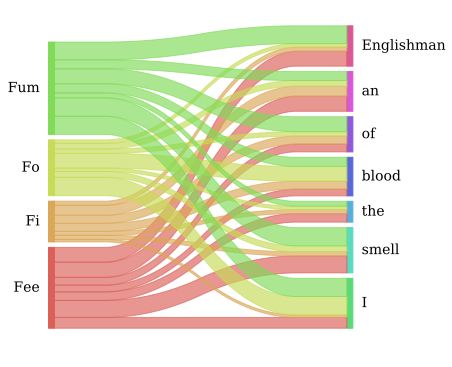

# Fork of pySankey
See the original project here: <a href="https://github.com/anazalea/pySankey">pySankey</a>

## Purpose of pySankey
Uses matplotlib to create simple <a href="https://en.wikipedia.org/wiki/Sankey_diagram">
Sankey diagrams</a> flowing only from left to right.

## Purpose of this Fork
Modify the interface of the main routine so as to allow passing of lists of colors
(without specifying the actual names (maybe they aren't pre-known?)), outputting as
SVG instead of PNG, and eventually add more resilience to the allowed input structures.



## Requirements
This fork has no intention of being compatible with Python 2 or less. If you
require a Python 2 solution, see the original project (link at the top of this README).

Requires python3-tk (Use your system package manager, or install from source).
The rest of the requirements are Python packages, found in the requirements.txt file.
Install them with:

``` bash
$ pip3 install -r requirements.txt
```

